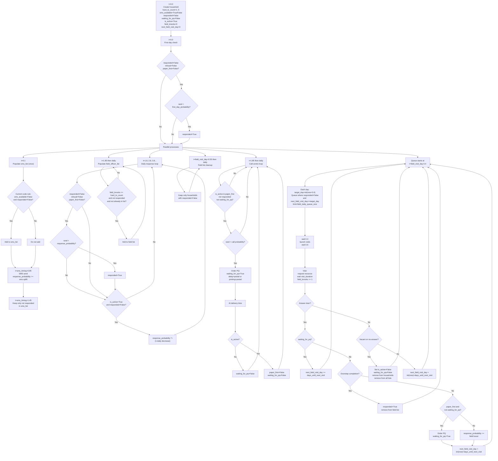

# Household Journey Flowchart

This file stores the Mermaid source code for the household-level end-to-end model flow.

```mermaid
flowchart TD
    A["t=0.0<br/>Create household<br/>hard_to_count=1..5<br/>sms_available=True/False<br/>responded=False<br/>waiting_for_pq=False<br/>is_active=True<br/>field_knocks=0<br/>next_field_visit_day=0"] --> B["t=0.0<br/>First-day check"]

    B --> B1{"responded=False<br/>refusal=False<br/>paper_first=False?"}
    B1 -- No --> P
    B1 -- Yes --> B2{"rand < first_day_probability?"}
    B2 -- Yes --> B3["responded=True"]
    B2 -- No --> P
    B3 --> P

    P["Parallel processes"] --> S0["t=0.1<br/>Populate sms_list (once)"]
    S0 --> S1{"Current code rule:<br/>sms_available=False<br/>and responded=False?"}
    S1 -- Yes --> S2["Add to sms_list"]
    S1 -- No --> S3["Do not add"]

    S2 --> S4["t=sms_timing+0.85<br/>SMS send<br/>response_probability += sms uplift"]
    S3 --> S4
    S4 --> S5["t=sms_timing+1.45<br/>Keep only not responded<br/>in sms_list"]

    P --> D0["t=1.8, 2.8, 3.8...<br/>Daily response loop"]
    D0 --> D1{"responded=False<br/>refusal=False<br/>paper_first=False?"}
    D1 -- Yes --> D2{"rand < response_probability?"}
    D2 -- Yes --> D3["responded=True"]
    D2 -- No --> D4
    D1 -- No --> D4
    D3 --> D4{"is_active=True<br/>and responded=False?"}
    D4 -- Yes --> D5["response_probability *=<br/>(1-daily decrease)"]
    D4 -- No --> D0
    D5 --> D0

    P --> C0["t=1.85 then daily<br/>Call-centre loop"]
    C0 --> C1{"is_active & paper_first<br/>not responded<br/>not waiting_for_pq?"}
    C1 -- No --> C0
    C1 -- Yes --> C2{"rand < call probability?"}
    C2 -- No --> C0
    C2 -- Yes --> C3["Order PQ<br/>waiting_for_pq=True<br/>delay=postal or printing+postal"]
    C3 --> C4["At delivery time"]
    C4 --> C5{"is_active?"}
    C5 -- No --> C6["waiting_for_pq=False"]
    C5 -- Yes --> C7["paper_first=False<br/>waiting_for_pq=False"]
    C6 --> C0
    C7 --> C0

    P --> F0["t=1.85 then daily<br/>Populate field_officer_list"]
    F0 --> F1{"field_knocks <= hard_to_count<br/>and not responded<br/>and not already in list?"}
    F1 -- Yes --> F2["Add to field list"]
    F1 -- No --> F0
    F2 --> F0

    P --> Q0["Queue starts at<br/>t=field_visit_day-0.4"]
    Q0 --> Q1["Each day:<br/>target_day=int(now+0.4)<br/>Queue where responded=False<br/>and next_field_visit_day<=target_day<br/>limit=field_daily_queue_size"]
    Q1 --> Q2["wait 0.4<br/>launch visits<br/>wait 0.6"]

    Q2 --> V0["Visit:<br/>request resource<br/>wait visit_duration<br/>field_knocks += 1"]
    V0 --> V1{"Answer door?"}

    V1 -- Yes --> V2{"waiting_for_pq?"}
    V2 -- Yes --> V3["next_field_visit_day += days_until_next_visit"]
    V2 -- No --> V4{"Doorstep completion?"}
    V4 -- Yes --> V5["responded=True<br/>remove from field list"]
    V4 -- No --> V6{"paper_first and<br/>not waiting_for_pq?"}
    V6 -- Yes --> V7["Order PQ<br/>waiting_for_pq=True"]
    V6 -- No --> V8["response_probability +=<br/>field boost"]
    V7 --> V9["next_field_visit_day =<br/>int(now)+days_until_next_visit"]
    V8 --> V9
    V3 --> Q0
    V5 --> Q0
    V9 --> Q0

    V1 -- No --> V10{"Vacant on no-answer?"}
    V10 -- Yes --> V11["Set is_active=False<br/>waiting_for_pq=False<br/>remove from households<br/>remove from all lists"]
    V10 -- No --> V12["next_field_visit_day =<br/>int(now)+days_until_next_visit"]
    V11 --> Q0
    V12 --> Q0

    P --> E0["t=field_visit_day+0.55 then daily<br/>Field list cleanup"]
    E0 --> E1["Keep only households<br/>with responded=False"]
    E1 --> E0
```
